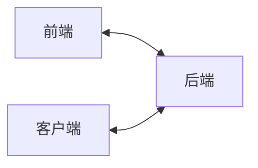

# easy-start

这个仓库旨在为计算机新手快速的上手语言、学习开发流程、参与西二在线工作室的考核而准备

## 目录

首先你需要学会一定的Git知识，考虑到访问问题，这部分内容移步至飞书，可以访问：[Git与Github超容易入门](https://west2-online.feishu.cn/wiki/Lsz9w3CiGinXzgkevtmceHZknrf)

| 使用语言/方向 | 地址                                                         | 备注   |
| ------------- | ------------------------------------------------------------ | ------ |
| Java          | [west2-online Java考核指南](https://github.com/west2-online/learn-java) | 后端   |
| Go            | [west2-online Golang考核指南](https://github.com/west2-online/learn-go) | 后端   |
| Unity         | [west2-online Unity考核指南](https://github.com/west2-online/learn-unity) | 客户端 |
| PythonAI      | [west2-online PythonAI考核指南](https://github.com/west2-online/learn-AI) | AI     |
| 前端          | [west2-online 前端考核指南](https://github.com/west2-online/learn-front-end) | 前端   |

## 关系

| 名称 | 解释                                                         |
| ------------- | ------------------------------------------------------------ |
| 前端          | 通常指你的浏览器页面，广义上前端包含客户端（与用户交互），前端负责展示页面（与用户交互）、发送特定数据给后端，让后端来处理 |
| 客户端            | 通常指你手机上的App、电脑上的软件，这些都是客户端，客户端的作用与前端一致 |
| 后端         | 隐藏在远程服务器（或者本地上）的，用户接触不到的地方，承担着整个项目的核心功能实现 |
